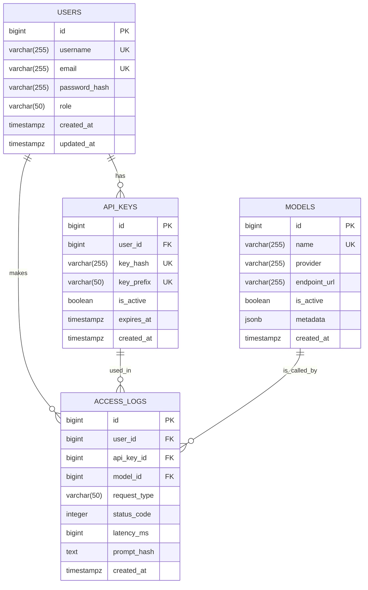

# 数据库设计方案：企业级大模型克隆平台

## 1. 设计概述

本数据库方案采用`PostgreSQL`，设计遵循第三范式（3NF），旨在保证数据一致性的同时，兼顾查询性能和未来的可扩展性。核心围绕用户、API密钥、模型和访问日志进行设计。

## 2. ER图 (Entity-Relationship Diagram)



## 3. 表结构详细设计 (DDL)

```sql
-- 用户表：存储平台的用户信息
CREATE TABLE users (
    id BIGSERIAL PRIMARY KEY,
    username VARCHAR(255) NOT NULL UNIQUE,
    email VARCHAR(255) NOT NULL UNIQUE,
    password_hash VARCHAR(255) NOT NULL, -- 存储加密后的密码
    role VARCHAR(50) NOT NULL DEFAULT 'user', -- e.g., 'user', 'admin'
    created_at TIMESTAMPTZ NOT NULL DEFAULT NOW(),
    updated_at TIMESTAMPTZ NOT NULL DEFAULT NOW()
);

-- API密钥表：存储用户的API密钥信息
CREATE TABLE api_keys (
    id BIGSERIAL PRIMARY KEY,
    user_id BIGINT NOT NULL REFERENCES users(id) ON DELETE CASCADE,
    key_hash VARCHAR(255) NOT NULL UNIQUE, -- 存储哈希后的密钥，保障安全
    key_prefix VARCHAR(50) NOT NULL UNIQUE, -- 密钥前缀，用于快速查找和识别
    is_active BOOLEAN NOT NULL DEFAULT TRUE,
    expires_at TIMESTAMPTZ,
    created_at TIMESTAMPTZ NOT NULL DEFAULT NOW()
);

-- 模型配置表：存储接入的大模型信息
CREATE TABLE models (
    id BIGSERIAL PRIMARY KEY,
    name VARCHAR(255) NOT NULL UNIQUE, -- e.g., 'gpt-4o', 'deepseek-coder-v2'
    provider VARCHAR(255) NOT NULL, -- e.g., 'OpenAI', 'Deepseek'
    endpoint_url VARCHAR(255) NOT NULL, -- 模型的调用地址
    is_active BOOLEAN NOT NULL DEFAULT TRUE,
    metadata JSONB, -- 存储模型的额外配置，如版本、支持的参数等
    created_at TIMESTAMPTZ NOT NULL DEFAULT NOW()
);

-- 访问日志表：记录每一次API调用
CREATE TABLE access_logs (
    id BIGSERIAL PRIMARY KEY,
    user_id BIGINT NOT NULL REFERENCES users(id),
    api_key_id BIGINT NOT NULL REFERENCES api_keys(id),
    model_id BIGINT NOT NULL REFERENCES models(id),
    request_type VARCHAR(50) NOT NULL, -- e.g., 'chat', 'completions', 'embeddings'
    status_code INTEGER NOT NULL,
    latency_ms BIGINT NOT NULL, -- 请求耗时（毫秒）
    prompt_hash TEXT, -- prompt的哈希值，用于缓存和统计
    created_at TIMESTAMPTZ NOT NULL DEFAULT NOW()
);

-- 为常用查询创建索引
CREATE INDEX idx_api_keys_user_id ON api_keys(user_id);
CREATE INDEX idx_access_logs_user_id ON access_logs(user_id);
CREATE INDEX idx_access_logs_api_key_id ON access_logs(api_key_id);
CREATE INDEX idx_access_logs_model_id ON access_logs(model_id);
CREATE INDEX idx_access_logs_created_at ON access_logs(created_at);
```

## 4. 设计说明

- **安全性**: 
  - `users.password_hash`: 从不存储明文密码，只存储使用`bcrypt`或`argon2`等强哈希算法计算后的哈希值。
  - `api_keys.key_hash`: 从不存储完整的API密钥，只存储其哈希值。当用户提供密钥时，后端同样进行哈希运算并与数据库中的值进行比对。`key_prefix`用于在日志和UI中安全地展示密钥的一部分，便于用户识别。
- **可扩展性**:
  - `models.metadata`: 使用`JSONB`类型，可以灵活地存储不同模型的特定配置，如最大token数、支持的temperature范围等，无需修改表结构。
- **性能**:
  - 在外键和经常用于查询条件的列上创建了索引（如`access_logs.created_at`），以加速查询，特别是对于生成统计报告等场景。